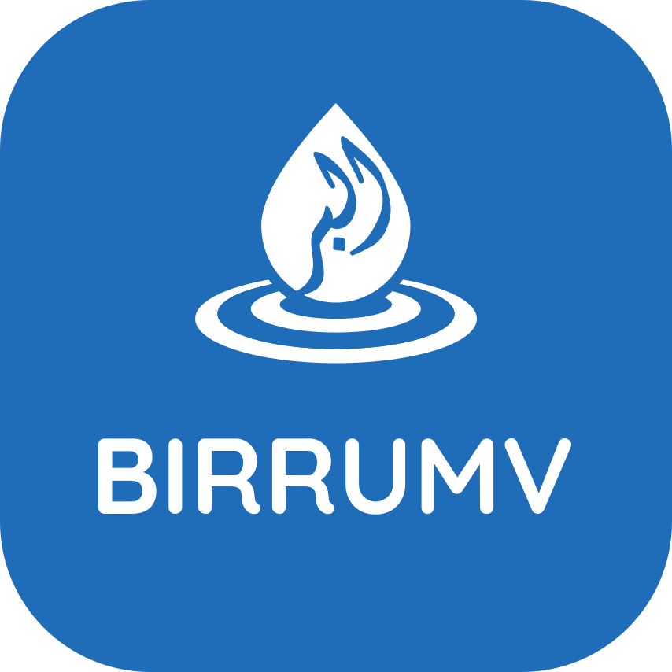

# BirruMv — Only the Best Wells & Aqiqah



> **BirruMv** is a Maldivian charitable initiative providing well construction (Nepal, Africa) and Aqiqah/Udhiya sacrifice services across multiple African countries.

---

## 📁 Directory Structure

```
bmv/index/
├── index.html              # Main landing page
├── style.css               # Core stylesheet (modular)
├── main.js                 # JavaScript (carousel, tabs, modal, calculator)
├── font/
│   ├── merged-300.woff2    # Custom font (WOFF2)
│   └── merged-300.woff     # Custom font (WOFF)
├── img/                    # Image assets (WebP format, 500px width)
├── info/                   # Markdown content files (loaded dynamically)
│   ├── aqiqah.md
│   └── udhiya.md
├── docs/                   # Project documentation
│   ├── architecture.md
│   ├── content-strategy.md
│   ├── design-guide.md
│   ├── seo.md
│   ├── accessibility.md
│   └── maintenance.md
├── old/                    # Archived previous versions
└── README.md               # This file
```

---

## ✨ Key Features

- **Bilingual**: English & Dhivehi (ދިވެހި) — side-by-side layout
- **Dark/Light Mode**: Auto-detects system preference via `@media (prefers-color-scheme)`
- **Responsive**: Mobile-first design, fluid grid, accessible on all devices
- **Fast**: Optimized images (WebP, 500px), custom fonts, modular CSS/JS
- **Accessible**: Semantic HTML, ARIA attributes, keyboard-friendly
- **Modular**: Separated HTML, CSS, and JS files for maintainability

---

## 🚀 Services Offered

| Service                  | Region | Price Range |
| ------------------------ | ------ | ----------- |
| Standard Hand Pump Well  | Nepal  | 4,500 MVR   |
| Electric Motor Pump Well | Nepal  | 6,500 MVR   |
| Goat (Aqiqah/Udhiya)     | Africa | 749 MVR     |
| Sheep (Aqiqah/Udhiya)    | Africa | 995 MVR     |
| Cow (Aqiqah/Udhiya)      | Africa | 5,650 MVR   |

---

## 🛠 Maintenance

See the [Maintenance Guide](docs/maintenance.md) for detailed instructions on:

- Updating prices
- Adding products (images, cards)
- Updating social media links and contact methods
- Managing expandable info sections (Aqiqah/Udhiya content in `info/`)
- Font updates
- CSS/JS modifications
- Deployment checklist

---

## 🌐 Deployment

The site is deployed via **GitHub Pages** at [birrumv.com](https://birrumv.com).

To deploy:

```bash
git add .
git commit -m "Update description"
git push origin main
```

---

## 📄 License

Copyright © BirruMv — All Rights Reserved

---

## 📞 Contact

- **Facebook**: [fb.me/birrumv](http://fb.me/birrumv)
- **Telegram**: [t.me/birrumv](http://t.me/birrumv)
- **Viber**: [Invite Link](https://invite.viber.com/?g2=AQA%2BbvnySNQHZEy9axm1ck2TX/ZVrvGtq/bJboZzADy3OssLND4H1TFWklNmNQZC)
- **WhatsApp**: [Chat](https://wa.me/message/IVXJAT4EBQ35C1)
- **Instagram**: [@birrumv](https://instagram.com/birrumv)
- **Twitter/X**: [@birrumv](https://twitter.com/birrumv)
- **YouTube**: [@birrumv](https://www.youtube.com/@birrumv)
- **Email**: birrumv@gmail.com
